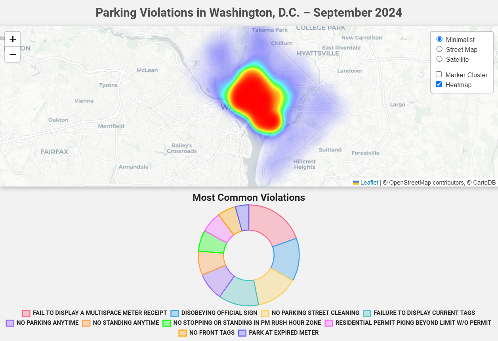

# Visualizing Parking Violations in Washington, D.C. – September 2024🏛️

This project analyzes and visualizes parking violation data from September 2024 in Washington D.C. 

**Data Source:**

* [DC.gov Parking Violations Dataset](https://catalog.data.gov/dataset/parking-violations-issued-in-september-2024))

## 🌐 GitHub Page
[**Parking Violations in Washington, D.C. &ndash; September 2024**](https://danomearawd.github.io/project3-team4/)  
You can view the deployed app above:

##  Key Features

* **Interactive Map:** Explore violation locations using a heatmap with marker clusters, built with [Leaflet.js](https://leafletjs.com/)). 
* **Violation Breakdown:** Visualize the most common violations with a donut chart using [Chart.js](https://www.chartjs.org/)).
* **Additional Analysis:** Uncover patterns in parking violations using Matplotlib visualizations (located in the `output/img` folder):
    * Violations by time of day
    * Violations by day of the week
    * Ticket fines distribution
    * Ticket penalties distribution
    * Ticket payments distribution

